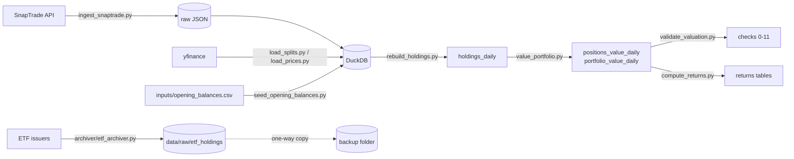

# Portfolio Analytics

Local portfolio analytics in Python and DuckDB: brokerage history via SnapTrade, daily
split-correct valuation with an independent validator, and a daily ETF holdings archiver.

---

## Why

ETF issuers publish holdings for the **current day only**. A day that is not captured
cannot be recovered later, so a look-through view of what a portfolio actually owns
(through its funds) depends on archiving those files every day, reliably. The rest of
the project turns brokerage transaction history into daily holdings and values that the
look-through data can be joined to.

---

## What it does

- **Brokerage ingestion.** Accounts, positions and full transaction history from
  SnapTrade (read-only GET endpoints, Personal API key) into DuckDB. Raw responses are
  saved before parsing; the database is backed up before writing; each account is
  written in its own transaction.
- **Holdings rebuild.** Daily units per account and symbol reconstructed from
  transactions, split history and opening balances, in today's share terms, then
  reconciled against the broker's latest positions.
- **Daily valuation.** Every held position valued daily from observed, split-adjusted
  closes (securities only), with a separate validator that recomputes the numbers a
  different way.
- **ETF holdings archiver.** Downloads each tracked fund's daily holdings file:
  raw-save-first, an HTML/bot-block guard, quarantine of rejected responses, and
  hash-based dedupe, with logging, a lock, retries and a one-way backup copy.

---

## Architecture



### Database tables

| Table | Contents |
|---|---|
| `accounts` | Brokerage accounts from SnapTrade |
| `positions` | Holdings as reported by the broker, one dated snapshot per run day |
| `transactions` | Buys, sells, dividends, reinvestments, fees (upserted on SnapTrade's activity id) |
| `holdings_daily` | **Rebuilt** daily units per account/symbol, in today's share terms |
| `splits` | Corporate actions from yfinance. `ratio` is the forward factor: 10:1 is `10.0`, 1:20 reverse is `0.05` |
| `opening_balances` | Units held before transaction history begins |
| `prices` | Observed daily closes (split-adjusted `Close`), one row per symbol per observed day |
| `positions_value_daily` | **Derived** daily value per position (quantity x price) |
| `portfolio_value_daily` | **Derived** account and `ALL` totals per date, securities only |
| `funds` | Tracked ETFs and whether their holdings can be automated |
| `fund_holdings` | ETF look-through holdings (not yet populated: raw captures are not parsed into it yet) |
| `raw_files` | Audit table for download attempts (not yet written by the archiver) |
| `job_runs` | One row per item per run of a scheduled job, plus a `_run` summary row; `job_name` identifies the job |
| `fx_rates` | Exchange rates, read with an as-of lookup (latest rate on or before a date) |
| `securities`, `sync_log` | Reference data and run bookkeeping |

`positions` is what the broker says is held now; `holdings_daily` is what the
transaction record implies was held on each day. `rebuild_holdings.py` reconciles the
two on the final day and reports any residual.

---

## Stack

Python 3.12 · DuckDB · pandas · SnapTrade Python SDK · yfinance · curl_cffi · openpyxl ·
pyarrow · scipy · pytest · PowerShell and Windows Task Scheduler (archiver scheduling).

---

## Quickstart with sample data

Fully offline after installing packages: no `.env`, no SnapTrade account, no network.
`sample_data/` holds a fabricated two-year history (SPY, AAPL, MSFT, JNJ and the made-up
ticker XYZ with a made-up 10:1 split) and a fabricated daily price file.

```powershell
git clone <repository-url> portfolio-analytics
cd portfolio-analytics
python -m venv ..\portfolio-venv
..\portfolio-venv\Scripts\python.exe -m pip install -r requirements.txt
..\portfolio-venv\Scripts\python.exe scripts\make_sample_data.py
..\portfolio-venv\Scripts\python.exe scripts\rebuild_holdings.py --db sample_data\sample.duckdb
..\portfolio-venv\Scripts\python.exe scripts\value_portfolio.py --db sample_data\sample.duckdb
..\portfolio-venv\Scripts\python.exe -m pytest tests
```

Keep the virtual environment outside any cloud-synced folder (e.g. OneDrive): a venv
inside one throws `PermissionError` during installs and can silently lose packages.

`make_sample_data.py` rebuilds `sample_data/sample.duckdb` from scratch each time (it
refuses to write under `data/`). `rebuild_holdings.py` and `value_portfolio.py` accept
`--db PATH` or the `PORTFOLIO_DB` environment variable; without either they use
`DB_PATH` from `.env`, then `data/portfolio.duckdb`. Relative paths resolve against the
project root. `PORTFOLIO_DB` is honoured only by those two scripts, so do not leave it
set when running `validate_valuation.py`.

---

## Using your own data

### Private files

Everything personal lives in gitignored files; each has a committed template with
made-up values (`ACCT-0001`, ticker `XYZ`). Copy the template, then fill it in:

| Private file (gitignored) | Template | Holds |
|---|---|---|
| `.env` | `.env.example` | SnapTrade credentials, database path |
| `archiver/config.ini` | `archiver/config.example.ini` | Folder paths, backup folder, Python paths, **the fund list** |
| `inputs/opening_balances.csv` | `inputs/opening_balances.example.csv` | Units held before history begins |
| `inputs/accepted_exceptions.local.csv` | `inputs/accepted_exceptions.local.example.csv` | Reviewed small residuals |
| `inputs/reviewed_jumps.local.csv` | `inputs/reviewed_jumps.local.example.csv` | Price jumps checked by hand |
| `inputs/statement_checkpoints.csv` | `inputs/statement_checkpoints.example.csv` | Month-end statement values |
| `inputs/statement_gain_checkpoints.csv` | `inputs/statement_gain_checkpoints.example.csv` | Monthly statement activity |
| `inputs/broker_return_checkpoints.csv` | `inputs/broker_return_checkpoints.example.csv` | Broker-reported return figures |

Scripts locate these relative to their own files, so they behave the same when started
by Task Scheduler. A missing `*.local.csv` means "none listed".

### `.env`

| Variable | Purpose |
|---|---|
| `SNAPTRADE_CLIENT_ID` | SnapTrade Personal API key |
| `SNAPTRADE_CONSUMER_KEY` | SnapTrade Personal consumer key |
| `DB_PATH` | DuckDB file, default `data/portfolio.duckdb` |

SnapTrade's **Personal** flow is used: the key identifies the user, so
`SNAPTRADE_USER_ID` and `SNAPTRADE_USER_SECRET` are not used. Credentials are never
printed or logged, and error text is scrubbed before display (SnapTrade's 401 response
echoes the client ID). Optional one-run switches for `ingest_snaptrade.py`:
`SNAPTRADE_DRY_RUN=1` (fetch and save raw files, write nothing) and
`SNAPTRADE_ALLOW_POSITION_DROP=1` (accept a genuine large sell-off).

### Pipeline

Run in this order on a fresh database; all steps are safe to re-run.

| Script | What it does |
|---|---|
| `create_db.py` | Creates all tables with `CREATE TABLE IF NOT EXISTS`; never drops, overwrites or inserts. |
| `seed_funds.py` | Seeds the `funds` table from `archiver/config.ini` (config is authoritative). |
| `snaptrade_check.py` | Read-only connectivity test; lists accounts with masked account numbers. |
| `ingest_snaptrade.py` | Pulls accounts, positions and transactions. Stops if a brokerage connection is disabled; skips an account whose position count drops by more than half; exit codes documented in the script. |
| `load_splits.py` | Loads split history from yfinance for every traded symbol. |
| `seed_opening_balances.py` | Upserts opening balances from `inputs/opening_balances.csv`. |
| `rebuild_holdings.py` | Rebuilds `holdings_daily`; reconciles against the latest positions. |
| `load_prices.py` | Loads daily closes for every held symbol; re-pulls full history each run. |
| `value_portfolio.py` | Builds `positions_value_daily` and `portfolio_value_daily`. |
| `validate_valuation.py` | 15 independent checks (0-11); exits non-zero on any FAIL. |
| `compute_returns.py` / `validate_returns.py` | Returns tables and their validation (in progress, see Status). |

**Any new split requires a full price re-download.** yfinance restates historical
closes and `rebuild_holdings.py` restates units whenever a split occurs; restating only
one side makes every valuation before the split wrong by the split ratio. After a split:
`load_splits.py`, then `load_prices.py` (full re-download), `rebuild_holdings.py`,
`value_portfolio.py`. `validate_valuation.py` check 0 fails if a split is newer than the
last price download, or if units jump or prices drop on a split date.

**Residuals.** A rebuilt holding is flagged when it differs from the broker's by more
than 0.5% of the maximum units ever held (relative, so large positions are not excused
large errors and tiny ones are not flagged for rounding). A known small residual is not
"fixed" with an invented trade: once reviewed, it is listed in
`inputs/accepted_exceptions.local.csv` and reported as KNOWN rather than NEW. A sale
with no recorded purchase gets an opening balance inferred from the sale quantity.

### Scheduling the archiver

```powershell
powershell -ExecutionPolicy Bypass -File scripts\register_archiver_task.ps1
```

Registers one task, `PortfolioAnalytics_ETFArchiver`, running daily at two times set at
the top of the script (defaults 7:15 AM and 1:00 PM; the second run only retries funds
not yet captured that day). The script finds the repo from its own location and runs
`task_python` from `archiver/config.ini`. Task settings: catch up after a missed start,
run and keep running on battery, wake to run, require network, 30-minute limit, no
parallel instances, interactive logon (no stored password). It also creates a desktop
shortcut to the status file unless `$MakeDesktopShortcut` is set to `$false`.

| Action | Command |
|---|---|
| Run now | `schtasks /run /tn PortfolioAnalytics_ETFArchiver` |
| Run in a console | `<venv>\Scripts\python.exe archiver\etf_archiver.py` |
| Test without touching the archive | `... etf_archiver.py --sandbox <folder>` |
| Validate one file | `... etf_archiver.py --check-file <file>` |
| Check last run | `Get-ScheduledTaskInfo PortfolioAnalytics_ETFArchiver \| Format-List LastRunTime, LastTaskResult, NextRunTime` |
| Pause / resume | `Disable-ScheduledTask` / `Enable-ScheduledTask -TaskName PortfolioAnalytics_ETFArchiver` |
| Remove | `powershell -ExecutionPolicy Bypass -File scripts\unregister_archiver_task.ps1` (captured files are untouched) |

`LastTaskResult`: `0` every automated fund captured, unchanged or already captured;
`1` a fund failed or was blocked; `2` could not start (the status file says why);
`3` another run was in progress; `267011` not run yet.

Per-fund statuses: **captured** (new file saved), **unchanged** (byte-identical to the
last saved file, not stored twice), **already captured** (saved earlier today),
**blocked** (bot-block page or 403, quarantined), **failed** (reason in the status
file), **manual** (not automated).

**Manual funds** (`issuer = manual` in `config.ini`): save the issuer's file into
`data/raw/etf_holdings/_manual_inbox/` with the ticker at the start of the name (e.g.
`XYZ_holdings.csv`) and run the archiver; it is validated exactly like a download.

| What | Where |
|---|---|
| Saved holdings | `data/raw/etf_holdings/YYYY-MM-DD/<TICKER>_<issuer>.<ext>` (download date; the as-of date is inside the file) |
| Rejected responses | `data/raw/etf_holdings/_rejected/YYYY-MM-DD/`, each with a `.reason.txt` |
| Backup copy | `backup_root` in `archiver/config.ini` (one-way; never read, deleted or overwritten) |
| Run summary | `ETF_ARCHIVER_STATUS.txt` |
| Log | `logs/etf_archiver_YYYY-MM-DD.log` (kept 90 days) |
| Run history | `job_runs`, `job_name = 'etf_archiver'` |

Saved files are never overwritten, moved or deleted.

---

## Project structure

| Folder | Contents |
|---|---|
| `archiver/` | ETF holdings archiver, its config template and a one-off archive migration tool |
| `scripts/` | Ingestion, rebuild, pricing, valuation, validation, returns, sample data and task registration |
| `tests/` | pytest suite: returns maths and an end-to-end sample-data smoke test |
| `inputs/` | Templates for private inputs (real files are gitignored) |
| `sample_data/` | Fabricated sample database and price file for the quickstart |
| `src/` | Reserved; currently empty |
| `data/`, `logs/`, `reports/` | Local database, raw downloads, backups, logs and reports (gitignored) |

---

## Design decisions

- **Raw-save-first.** Every API response and download is written to disk before
  anything parses it; a parsing bug can be fixed later, a missed download cannot. The
  archiver stages each response in `_incoming/`, then files, dedupes or quarantines it.
  Downloaded files are validated before they count as holdings: issuers can answer with
  an HTML bot-block or error page, HTTP 200 and a data-file name. The guard checks for
  HTML/XML markup, the real `.xlsx` signature, parseable JSON with holdings rows, and a
  readable holdings table of at least one row. Manual files pass the same guard.
- **Coverage percentage over full automation.** Each fund carries an explicit
  `archive_status` (`automated`, `blocked`, `manual_permanent`, `unresearched`), and the
  status file lists the manual funds each day. Coverage is measured and grown
  incrementally instead of blocking on issuers that cannot be automated.
- **curl_cffi over a headless browser.** curl_cffi impersonates a real browser's TLS
  fingerprint, which is enough for the issuers that are automated, at a fraction of the
  cost and fragility of a headless browser. Retries are slow and limited to network
  errors and 429/5xx; block pages are never retried, since rapid repeats are what bot
  detection looks for.
- **Split-adjusted price basis.** `holdings_daily.units` is in today's share terms: each
  quantity is multiplied by every split ratio dated after it. Made-up example: XYZ splits
  10:1 in 2024, so 2 shares bought in 2022 are stored as 20 units throughout, and rows
  before a split do not match statements of the day. Prices are yfinance `Close` with
  `auto_adjust=False`: split-adjusted but not dividend-adjusted, because reinvested
  dividends are already counted as `REI` units and `Adj Close` would count them twice.
  With both sides restated the same way, units x close is correct across splits. Only
  observed prices are stored (no NULLs, no forward fill at load time); valuation carries a
  price forward at most 5 calendar days and marks older rows `missing`. Crypto is queried
  against USD (`BTC` as `BTC-USD`, recorded in `prices.source_ticker`), and a symbol held
  under two account types aborts the price load rather than mixing instruments. Money is
  computed in `DECIMAL`, and issuer currency codes are stored verbatim (`GBp` is pence,
  not `GBP`).
  To recover a statement-of-the-day quantity:

  ```sql
  SELECT h.units / (
      SELECT coalesce(exp(sum(ln(s.ratio))), 1)
      FROM splits s
      WHERE s.symbol = h.symbol AND s.split_date > h.as_of_date
  ) AS units_as_quoted_then
  FROM holdings_daily h
  WHERE h.symbol = 'XYZ' AND h.as_of_date = DATE '2022-03-22';
  ```

- **Independent validator.** `validate_valuation.py` does not import the valuation code.
  It recomputes from the source tables with correlated subqueries instead of an ASOF
  JOIN, and runs `value_portfolio.py` as a subprocess for its idempotency check. Its checks
  cover price basis, completeness, recompute to the cent, roll-ups, idempotency,
  staleness, split continuity, price jumps, attribution, four comparisons against
  SnapTrade (9a-9d), and statement checkpoints. `validate_returns.py` does the same for returns,
  recomputing every daily return in SQL.

---

## Status and roadmap

**Working:** SnapTrade ingestion; holdings rebuild and reconciliation; daily valuation
and its validator; the scheduled ETF archiver; offline sample data and tests.

**In progress:** returns module (`compute_returns.py`, `validate_returns.py`):
time-weighted return, portfolio and per-position XIRR, and broker/statement
comparisons. Per position, trust the simple return when a position is flagged
`multiple_rates_nearest_10pct` or `held_under_1y`; the money-weighted figure is for
reference only.

**Planned:**
- SEC N-PORT holdings via EDGAR
- parsing archived raw files into `fund_holdings` and `raw_files`
- a single `daily_run.py` entry point (SnapTrade ingestion is not yet scheduled)

**Known limits:**
- iShares endpoints are blocked by bot detection, so those funds are manual.
- Vanguard does not publish a public daily holdings file.
- Delisted tickers with no Yahoo price history cannot be valued.

---
